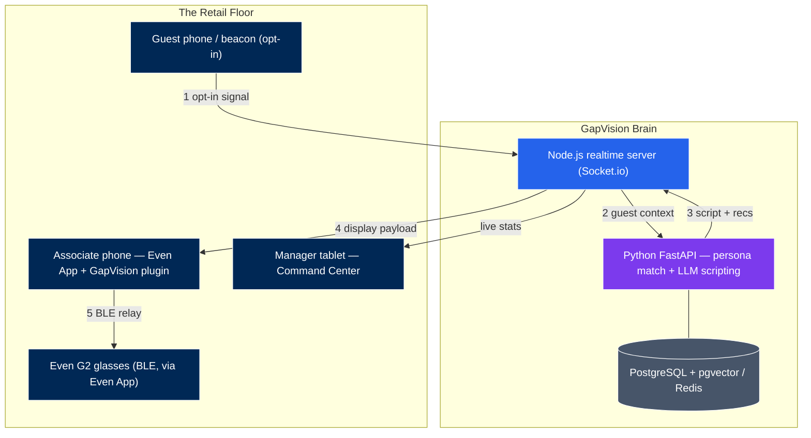

# GapVision — Simulator-First Prototype

An AR operating layer for retail associates: real-time CRM context, AI-driven
recommendations, and digital radio, delivered to Even Realities G2 smart
glasses. This monorepo is the hardware-free simulator — everything runs in a
browser today and is structured so the glasses view graduates into an Even Hub
plugin.

## Revised architecture (v2, Aug 2026)

The original handoff doc assumed a Raspberry Pi "compute pack" pairing with the
glasses over BLE. The shipped Even Hub model works differently and is simpler:



Key changes from v1: no Raspberry Pi (Even Hub plugins run server-side, loaded
by the official Even App on the associate's phone, relayed to glasses over
BLE); guest identification is opt-in beacon/app signal only (no cameras —
the G2 has none, and biometric ID is a legal minefield); the vision pipeline
(YOLO26, replacing YOLOv8) is deferred to Phase 2; LLM providers are pluggable
config, not architecture.

## Packages

| Package | Stack | Role |
|---|---|---|
| `packages/web` | React + Vite + Socket.io client | Command Center dashboard + simulated G2 Associate View (576×288 monochrome) |
| `packages/server` | Node.js + Express + Socket.io | The Nervous System — realtime routing, radio, session state |
| `packages/ai-service` | Python + FastAPI | The Brain — mock CRM, persona matching, provider-agnostic LLM scripting |

Styling is hand-rolled CSS design tokens for zero-dependency portability; swap
in Tailwind when the design system settles. Server state is in-memory (Redis
in production); persona matching is tag-overlap (pgvector/Pinecone in
production). Both keep the API contracts of their production counterparts.

## Run it

Three terminals (or a process manager):

```bash
# 1. AI service (Python 3.11+)
cd packages/ai-service
pip install -r requirements.txt
uvicorn app.main:app --port 8000

# 2. Realtime server (Node 20+)
npm install            # once, at repo root — installs workspaces
npm run dev:server

# 3. Web app
npm run dev:web        # → http://localhost:5173
```

Open http://localhost:5173 in two tabs: one on **Associate View**, one on
**Command Center**. In the Associate View, tap a guest in the Beacon Simulator —
the in-lens display renders the monochrome overlay, the full script appears in
the phone panel, and the Command Center updates live. The radio panel
broadcasts to every connected associate.

## Environment

| Var | Default | Purpose |
|---|---|---|
| `GAPVISION_LLM` | `mock` | LLM provider: `mock`, `anthropic`, `openai`, `google` |
| `GAPVISION_CRM` | `mock` | CRM provider: `mock`, `shopify` (Gap adapter later) |
| `SHOPIFY_STORE_DOMAIN` | — | e.g. `your-store.myshopify.com` (shopify CRM only) |
| `SHOPIFY_CLIENT_ID` / `SHOPIFY_CLIENT_SECRET` | — | Dev Dashboard app credentials (2026+ flow; token auto-minted, auto-refreshed) |
| `SHOPIFY_ADMIN_TOKEN` | — | Alternative: static token from a pre-2026 legacy custom app |
| `AI_SERVICE_URL` | `http://localhost:8000` | Where the Node server finds the Brain |
| `VITE_SERVER_URL` | `http://localhost:4000` | Where the web app finds the realtime server |
| `VITE_AI_URL` | `http://localhost:8000` | Where the web app lists opted-in guests |

## Running on a real Shopify store

GapVision runs on live commerce data from any Shopify store (the wedge into
every Shopify POS retailer):

1. Shopify Admin → Settings → Apps and sales channels → **Develop apps** →
   **Build apps in Dev Dashboard** (2026+ flow) → your app → create a
   **version** → in the **Access** section add scopes `read_customers`,
   `read_orders`, `read_products`, `read_inventory` → **Release** the version →
   **Installs** → **Install app** on your store.
2. Grab the app's **Client ID** and **Client secret** from its credentials
   page. (No static token in the new flow — the adapter mints and refreshes
   24-hour tokens automatically via the client-credentials grant.)
3. Start the AI service with:
   `GAPVISION_CRM=shopify SHOPIFY_STORE_DOMAIN=xxx.myshopify.com SHOPIFY_CLIENT_ID=... SHOPIFY_CLIENT_SECRET=... uvicorn app.main:app --port 8000`
   (Legacy pre-2026 custom apps can still use `SHOPIFY_ADMIN_TOKEN` instead.)
3. The beacon panel now lists the store's real recent customers; guest cards
   derive tier from spend, sizes from purchase history, personas from product
   tags, and recommendations from live in-stock inventory.

Derivation rules and offline tests: `app/crm_shopify.py`,
`tests/test_shopify_adapter.py` (run `python3 tests/test_shopify_adapter.py`).

## Roadmap

1. **Even Hub plugin** — port `GlassesDisplay` line-rendering into an Even Hub
   plugin (TypeScript, `@evenrealities/even_hub_sdk`), test in the official
   simulator, then on G2 hardware.
2. **Real LLM** — implement `AnthropicProvider` (or others) in
   `packages/ai-service/app/llm.py`; the mock defines the contract.
3. **Real beacons** — Estimote UWB/BLE or the guest-app geofence signal
   replacing the Beacon Simulator panel.
4. **Persistence** — PostgreSQL + pgvector behind `crm.py`/`personas.py`,
   Redis behind the server's session state.
5. **Phase 2 vision** — YOLO26 pipeline as a separate opt-in module (fixture
   cameras, not body-worn; associate-facing only).
