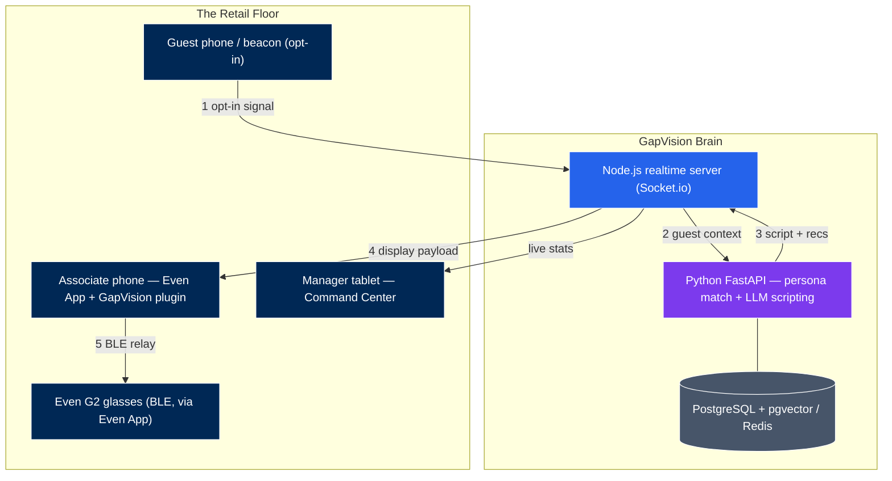

# GapVision — Simulator-First Prototype

An AR operating layer for retail associates: real-time CRM context, AI-driven
recommendations, and digital radio, delivered to Even Realities G2 smart
glasses. This monorepo is the hardware-free simulator — everything runs in a
browser today and is structured so the glasses view graduates into an Even Hub
plugin.

## Revised architecture (v2, Aug 2026)

The original handoff doc assumed a Raspberry Pi "compute pack" pairing with the
glasses over BLE. The shipped Even Hub model works differently and is simpler:



Key changes from v1: no Raspberry Pi (Even Hub plugins run server-side, loaded
by the official Even App on the associate's phone, relayed to glasses over
BLE); guest identification is opt-in beacon/app signal only (no cameras —
the G2 has none, and biometric ID is a legal minefield); the vision pipeline
(YOLO26, replacing YOLOv8) is deferred to Phase 2; LLM providers are pluggable
config, not architecture.

## Packages

| Package | Stack | Role |
|---|---|---|
| `packages/web` | React + Vite + Socket.io client | Command Center dashboard + simulated G2 Associate View (576×288 monochrome) |
| `packages/server` | Node.js + Express + Socket.io | The Nervous System — realtime routing, radio, session state |
| `packages/ai-service` | Python + FastAPI | The Brain — mock CRM, persona matching, provider-agnostic LLM scripting |

Styling is hand-rolled CSS design tokens for zero-dependency portability; swap
in Tailwind when the design system settles. Server state is in-memory (Redis
in production); persona matching is tag-overlap (pgvector/Pinecone in
production). Both keep the API contracts of their production counterparts.

## Run it

Three terminals (or a process manager):

```bash
# 1. AI service (Python 3.11+)
cd packages/ai-service
pip install -r requirements.txt
uvicorn app.main:app --port 8000

# 2. Realtime server (Node 20+)
npm install            # once, at repo root — installs workspaces
npm run dev:server

# 3. Web app
npm run dev:web        # → http://localhost:5173
```

Open http://localhost:5173 in two tabs: one on **Associate View**, one on
**Command Center**. In the Associate View, tap a guest in the Beacon Simulator —
the in-lens display renders the monochrome overlay, the full script appears in
the phone panel, and the Command Center updates live. The radio panel
broadcasts to every connected associate.

## Control plane (tenants, people, analytics)

Postgres behind the AI service. Everything the dashboards read lives here, so
it survives a redeploy — leaderboards that reset when someone pushes a commit
are not leaderboards.

```
tenants      slug, CRM provider, billing plan, privacy posture
users        associate | manager | client_admin | cue_admin
devices      G2s and rings, assigned to people
engagements  one guest interaction; guest_ref points at the CRM, never a copy
voice_queries  intent, outcome, latency, cost — transcript only if opted in
assists      helping someone else's guest, ranked as a first-class act
usage_daily  the rollup billing reads
```

Three roles' worth of surface, one spine:

| Route | Who |
|---|---|
| `/auth/login`, `/auth/me` | anyone with an account |
| `/api/analytics/*` | manager and up, pinned to their own tenant |
| `/api/admin/users`, `/devices`, `/tenants/{slug}` | client_admin for their retailer |
| `/api/admin/tenants` (all), billing, provisioning | cue_admin only |
| `/api/ingest/*` | the realtime server, via the service key — never a browser |

Tenant isolation runs through one function (`identity.scope_tenant`). A manager
who asks for another retailer's tenant gets their own data back, not an error:
there is no legitimate reason to ask, and a 403 confirms the tenant exists.

**Transcripts are off by default.** `tenants.privacy.store_transcripts` gates
them, and the analytics work without them — intent, outcome and latency carry
the reporting. What an associate said standing next to a customer isn't
something CueSea should accumulate as a side effect of a stock question.

**Leaderboards count assists.** Ranking retail staff on sales alone reliably
produces cherry-picking and kills the habit of covering for each other, so
assists are recorded as events and weighted (25 points each by default, tunable
per tenant), and every component of a score is returned so a ranking can be
explained rather than just asserted.

```bash
npm run db:migrate     # apply migrations (also runs on service boot)
npm run db:seed        # tenants + first admin; --demo adds a store
npm run test:spine     # floor socket → control plane → manager dashboard
```

Set `CUE_DATABASE_URL` (Railway's `DATABASE_URL` is read as a fallback). With
no database the lens still works — guest cards and voice predate the control
plane and must not start requiring one.

## Gestures — ring first

An associate standing in front of a customer can turn a ring on their finger
without anyone noticing. Reaching up to tap their temple is a visible tell that
they're consulting something. So the ring is the primary control and the temple
mirrors it.

| Gesture | Action |
|---|---|
| click | dismiss what's on the lens / end the engagement |
| double-click | open the mic and ask |
| scroll ↑ / ↓ | cycle the recommendations |

Scrolling also sets the voice context: whatever item is on the lens becomes what
"these" refers to, so an associate can scroll to a product and immediately ask
"do we have these in a 32" without naming it.

`src/gestures.ts` decodes the SDK's protobuf enums (`OsEventTypeList`,
`EventSourceType`) rather than pattern-matching observed hardware, so ring,
left temple and right temple are distinguishable and every event type is
handled. The host is Flutter and sends the same field as an ordinal, an enum
name, a shorthand, or a protoName key depending on the path — the decoder
accepts all of them, and the plugin page's **event inspector** shows anything it
couldn't decode, which is the one thing worth watching on real hardware.

```bash
npm run test:gestures          # decoder, every payload shape (no browser)
npm run test:gestures-browser  # carousel + voice context, headless
```

## Voice queries (double-click → ask → answer in-lens)

The associate double-presses the temple, asks a question out loud, and the
answer paints on the lens. No wake word, no second press to stop.

```
double-press ─▶ audioControl(true)
             ─▶ audioEvent PCM (16 kHz mono 16-bit LE)
             ─▶ plugin: level meter, RMS endpointing, 250 ms batches
             ─▶ socket voice:start / voice:chunk / voice:end
             ─▶ server buffers one utterance (15 s / 480 KB cap)
             ─▶ POST /api/voice-query ─▶ STT ─▶ answer engine
             ─▶ voice:result ─▶ glasses_lines on the lens
```

Answers are **grounded lookups, not model paraphrase**. Stock, size, price,
location, and guest-history questions resolve deterministically against the
CRM's floor inventory; only open-ended judgement calls ("what should I show
her next") reach the LLM. Sizing schemes are checked before anything is
quoted — a question about a 32x30 will never be answered with the tee that
happened to be on the lens, and a letter size is never offered as an
alternative to a waist size. If nothing matches, CueSea says so.

Context makes the deixis work: the server remembers the engaged guest and the
product currently displayed, so "do we have **these** in a 32" and "what did
**she** buy last time" both resolve without the associate naming anything.

Test it with no hardware and no vendor account — the MockBridge streams
synthetic PCM and the mock STT returns deterministic transcripts:

```bash
npm run test:ai             # answer engine + STT + endpoint (pytest)
npm run test:voice          # socket round trip against live services
npm run test:voice-browser  # full loop in headless Chromium via the MockBridge
```

Pin one transcript for a scripted demo with
`CUE_STT_MOCK_TRANSCRIPT="do we have these in a 32x30"`.

## Environment

| Var | Default | Purpose |
|---|---|---|
| `GAPVISION_API_KEY` | — | **Required in production.** Service key for the AI service; the realtime server holds it and attaches it. Generate with `openssl rand -hex 32` |
| `GAPVISION_AUTH_MODE` | `strict` | `strict` = every data call needs the key; `demo` = mock-data tenants readable without one (real CRMs always need it) |
| `GAPVISION_ALLOWED_ORIGINS` | localhost:5173,5180 | CORS allowlist for the AI service |
| `CUE_STT` | `mock` | STT provider: `mock`, `openai`, `groq`, `deepgram` |
| `CUE_STT_MODEL` | per-provider | Override the transcription model |
| `CUE_STT_MOCK_TRANSCRIPT` | — | Pin the mock transcript for demos |
| `OPENAI_API_KEY` / `GROQ_API_KEY` / `DEEPGRAM_API_KEY` | — | Key for the selected STT provider |
| `GAPVISION_LLM` | `mock` | LLM provider: `mock`, `grok`, `anthropic`, `openai`, `google` |
| `XAI_API_KEY` | — | Grok key (`xai-…`) when `GAPVISION_LLM=grok` |
| `CUE_LLM_MODEL` | `grok-4.20-0309-non-reasoning` | Override the model. The non-reasoning default is deliberate: reasoning models measured ~9.6s vs ~1.2s for a one-line opener |
| `GAPVISION_CRM` | `mock` | CRM provider: `mock`, `shopify` (Gap adapter later) |
| `CUE_CRED_KEY` | — | **Required to connect any store.** 32 bytes (`openssl rand -hex 32`) sealing merchants' CRM tokens at rest. Without it the service refuses to store one |
| `CUE_CRED_KEY_OLD` | — | The previous sealing key, during a rotation. Drop it once `/api/admin/platform` stops reporting rows on the old key |
| `SHOPIFY_STORE_DOMAIN` | — | **Deprecated.** Single-store fallback for the `shopify` tenant only — per-tenant credentials supersede it |
| `SHOPIFY_CLIENT_ID` / `SHOPIFY_CLIENT_SECRET` | — | **Deprecated**, as above |
| `SHOPIFY_ADMIN_TOKEN` | — | **Deprecated**, as above |
| `AI_SERVICE_URL` | `http://localhost:8000` | Where the Node server finds the Brain |
| `VITE_SERVER_URL` | `http://localhost:4000` | Where the clients find the realtime server — and, through its proxy, everything else |

Clients no longer take a `VITE_AI_URL`. They are static bundles, so anything
compiled into them is published; they reach the AI service only through the
realtime server, which holds the key server-side.

## Connecting a real Shopify store

CueSea runs on live commerce data from any Shopify store, and credentials are **per
tenant**, so one deployment serves any number of merchants. Each merchant
creates their own custom app and supplies a token — there is no Shopify app
review in the loop, which is what makes this the wedge into every Shopify POS
retailer.

**In the merchant's Shopify admin** — Settings → Apps and sales channels →
**Develop apps** → Create an app → **Configure Admin API scopes**:

| Scope | Without it |
|---|---|
| `read_customers` | no guest identity or tier |
| `read_orders` | no purchase history, no derived sizes |
| `read_products` | no recommendations |
| `read_inventory` | recommendations can't say what's actually on the floor |

Install the app, reveal the **Admin API access token** (`shpat_…`). Apps built
in the 2026+ Dev Dashboard have no static token — use the **Client ID** and
**Client secret** instead and the adapter mints and refreshes 24-hour tokens
itself.

**In CueSea Console** — Tenants → pick the retailer → **Shopify** → paste the
`.myshopify.com` domain and the token → **Connect and test**. Saving runs a live
check immediately and reports which scopes the token actually carries, so a
missing scope is caught at setup rather than by an associate on the floor.
Connecting a store is also what takes that tenant off the demo dataset;
disconnecting puts it back.

The token is sealed with AES-256-GCM before it reaches Postgres (`CUE_CRED_KEY`,
which the database never sees) and is never returned by any API — the console
shows a fingerprint. Details and threat model: `app/secrets_box.py`,
`migrations/002_tenant_crm_credentials.sql`.

Derivation rules and offline tests: `app/crm_shopify.py`,
`tests/test_shopify_adapter.py` (run `python3 tests/test_shopify_adapter.py`),
`tests/test_crm_credentials.py` (needs a Postgres at `CUE_TEST_DATABASE_URL`).

## Roadmap

1. **Even Hub plugin** — port `GlassesDisplay` line-rendering into an Even Hub
   plugin (TypeScript, `@evenrealities/even_hub_sdk`), test in the official
   simulator, then on G2 hardware.
2. **Real LLM** — implement `AnthropicProvider` (or others) in
   `packages/ai-service/app/llm.py`; the mock defines the contract.
3. **Real beacons** — Estimote UWB/BLE or the guest-app geofence signal
   replacing the Beacon Simulator panel.
4. **Persistence** — PostgreSQL + pgvector behind `crm.py`/`personas.py`,
   Redis behind the server's session state.
5. **Phase 2 vision** — YOLO26 pipeline as a separate opt-in module (fixture
   cameras, not body-worn; associate-facing only).
